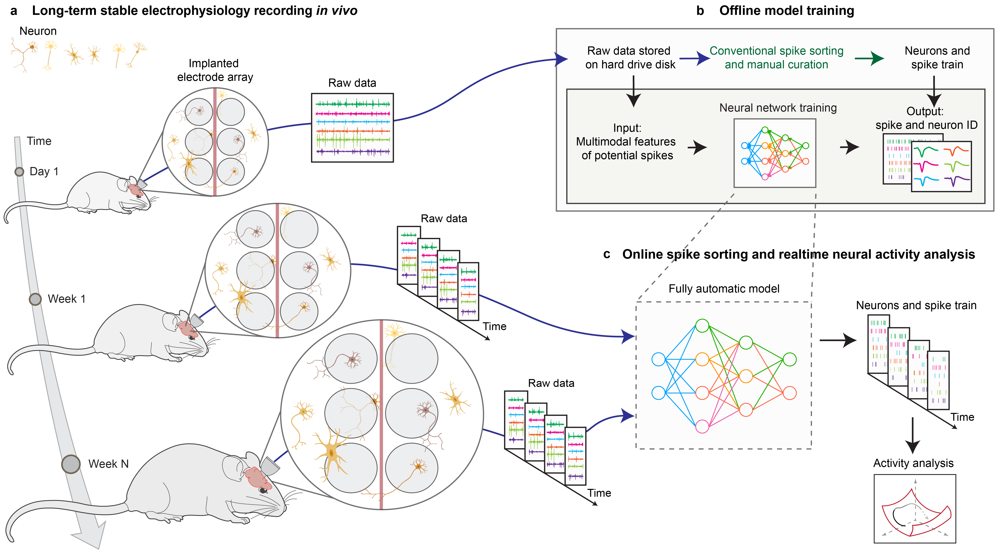
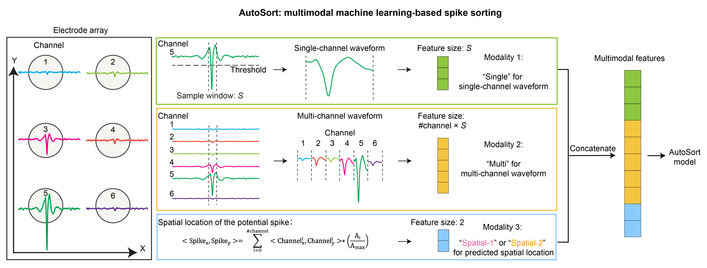

AutoSort
=====================================

Multimodal deep learning for real-time stable decoding of month-long neural activities from the same cells
-----------------------------------------------------------------------------------

    
    
AutoSort is designed to tackle two significant challenges in long-term stable recording. 
- First, it efficiently aligns neurons over the course of long-term recordings to ensure consistent tracking of the same neurons each day. 
- Second, it accurately sorts spikes while maintaining the precision throughout the recordings, ensuring that the performance achieved at the first of the recordings is sustained throughout the later days.

------------------------------------------

Contents
------------------------------------------
.. toctree::
   :maxdepth: 2

    Overview <self>
    Installation <install>
    Tutorials <tutorials>
    API Reference <api>
    About <about>

------------------------------------------

Quick start
------------------------------------------

Spike sorting
^^^^^^^^^^^^^^^^^^^^^
:mod:`autosort.run` provides tools to efficiently sort spikes from long-term recordings.

Online decoding
^^^^^^^^^^^^^^^^^^^
:mod:`autosort.decoding` provides tools to decode neural activities from the same cells across days.

Step-by-step guide 
^^^^^^^^^^^^^^^^^^^
Check out our detailed `tutorials <tutorials.html>`_ on how to use AutoSort with provided real electrophysiology datasets.

